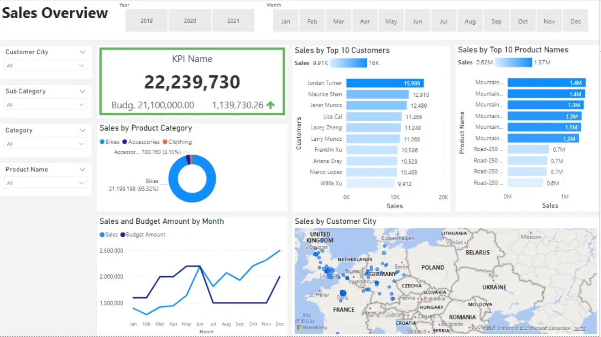
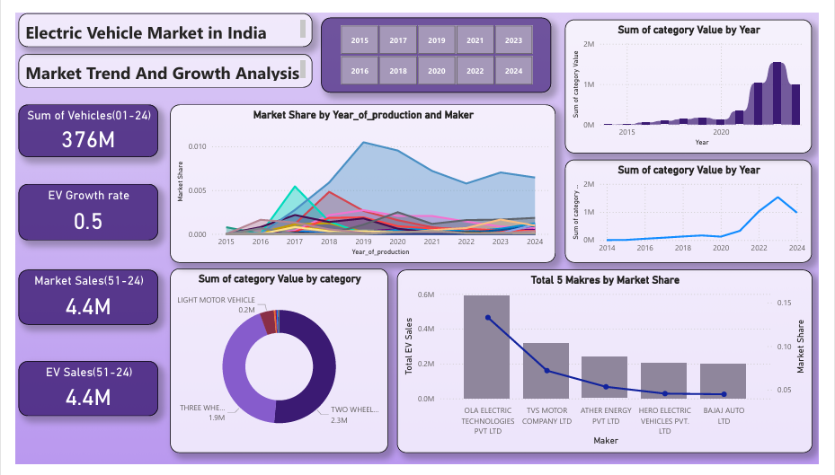
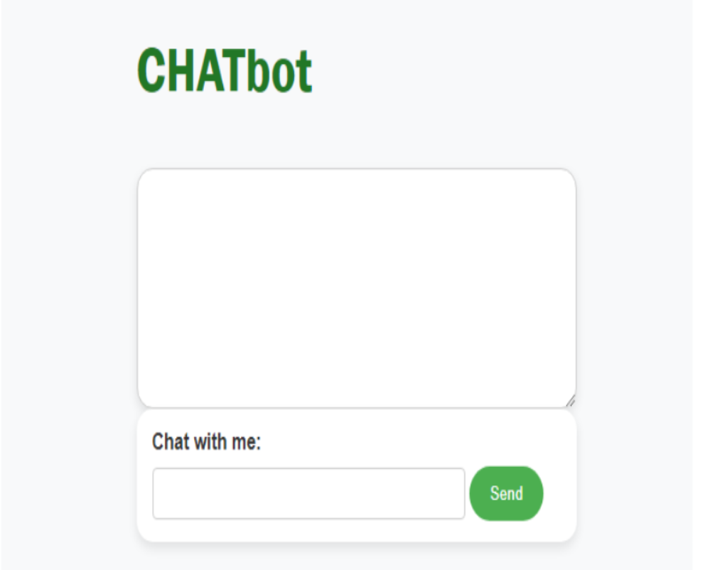

# Hi there, I'm Janhvi Patriwar! 👋

### 👩‍💻 Data Analyst | Python | SQL | Data Visualization Enthusiast

---

Welcome to my data-driven world! I'm a **B.Tech graduate** with a passion for **Python**, **SQL**, and turning raw numbers into compelling stories. I love working with data, whether it's cleaning up messy datasets or crafting stunning dashboards that even my grandma would understand! My goal? To make data **cool**, **accessible**, and **impactful**.

### 🛠️ **Tech Stack**
- **Data Analysis & Visualization**: `Pandas`, `NumPy`, `Matplotlib`, `Seaborn`
- **BI Tools**: `Power BI`, `Excel`, `SQL`
- **Python Development**: Clean, efficient, and happy code!
- **Databases**: `MYSQL` - My go-to for querying and storing data
- **Statistical Analysis**: Transforming numbers into insights since day one

---

### 🏆 **Experience**

#### 💼 Software & AI Intern - *CureXmedia, Nagpur* (01/2024–05/2024)
- Developed an **AI-powered WhatsApp chatbot** that speeds up property rental searches
- Conducted research and created reports to assist throughout the project
- Enhanced my data analysis skills while making complex topics simple for non-techies

---

### 💡 **Projects**

#### 🚴‍♂️ **Analyzing Bike Sales Data** (SQL & Power BI)
- Analyzed motorcycle parts sales across 3 warehouses to track revenue performance
- **SQL queries** helped derive insights into monthly net revenue by product line and location
- **Impact**: Created a **Power BI Dashboard** to visualize trends, helping the company make data-driven decisions!

 

#### 🔋 **Electric Vehicle Market in India** (Excel & Power BI)
- Analyzed EV market trends from 2015 to 2024 and projected future growth
- Designed a **Power BI Dashboard** with KPIs to visualize market growth trajectory
- **Impact**: Provided key insights to stakeholders, helping forecast the EV market's direction

#### 🤖 **GENAI Chatbot** (JavaScript)
- Built a sarcastic chatbot using **JavaScript**, **LangChain**, and **Express**
- Programmed witty, sarcastic responses for a fun customer experience
- **Impact**: Users loved the humor, adding a fun twist to human-computer interaction!

---

### 🎓 **Education**
**Bachelor of Technology - Computer Science & Engineering**  
Rastrasant Tukdoji Maharaj Nagpur University (2020-2024)  
**CGPA**: 7.99

---

### 💡 **Connect with Me**
- ) 
- **Email**: [janhvipatriwar7@gmail.com](mailto:janhvipatriwar7@gmail.com)

---

Let’s turn data into stories together! 🚀
